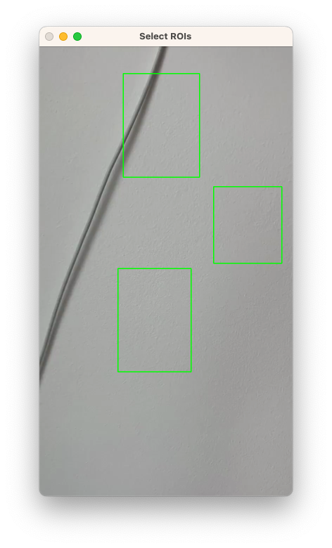
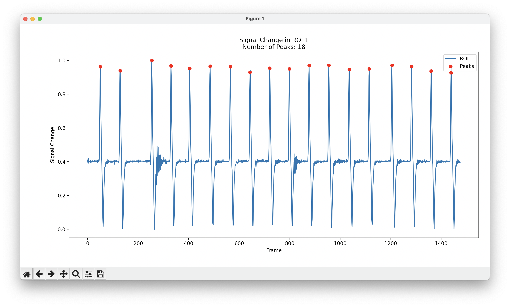

# Beat Counter

This script aims to quantify signal changes in a user-defined region of interest (ROI) within a video.
It is specially designed for highly periodic signals.
To do this, a user inputs a video path and selects ROIs.
The calculation averages the intensity values of the pixels in the ROI and compares them to the previous averages.
The result, including detected peaks (relative to the total number of recurring signal intensities), is visually displayed in a time series graph.
In addition, the time series values are stored in a comma-separated file format.

## How to get started

Open a terminal in the root folder of the project, activate a python environemnt and install the requirements:

```
pip install -r requirements.txt
```

Run the application and specify the corresponding video link as argument

```
python ./src/main.py --video_path ../data/test.mp4
```

To select the ROIs, simply drag rectangular squares into the displayed image (usually the first frame of the video) and confirm your selection by right-clicking (on the touchpad of an Apple device, this is usually done by a two-finger click).



## Result

The result should look like this


